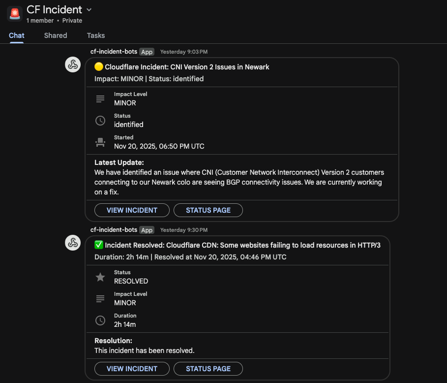

# Cloudflare Incidents Bot for Google Chat

[](https://workers.cloudflare.com/)
[](https://www.typescriptlang.org/)
[](https://www.gnu.org/licenses/gpl-3.0)

[](https://deploy.workers.cloudflare.com/?url=https://github.com/macharpe/cf-incidents-bots)

A comprehensive Cloudflare Worker that monitors the Cloudflare Status page and sends intelligent notifications to Google Chat. Features include resolution tracking, status updates, digest mode, metrics, and health monitoring.



## Features

### Intelligent Notifications

The bot sends **5 different types** of notifications:

1. **🔴 New Incident Alerts** - Immediate notification when a new incident is detected
2. **✅ Resolution Notifications** - Celebrates when incidents are resolved (with duration)
3. **📊 Status Updates** - Notifies when incident status progresses (investigating → identified → monitoring)
4. **🔧 Monitoring Alerts** - Special notification when a fix is deployed and being monitored
5. **📊 Digest Mode** - Batches multiple incidents (≥3) into a single summary notification

### Threaded Conversations

All notifications for the same incident appear in a **single Google Chat thread**:
- Initial incident alert creates a new thread
- Status updates, monitoring alerts, and resolution notifications reply to the same thread
- Makes it easy to follow the complete incident lifecycle in one place
- Uses Google Chat's `threadKey` feature for reliable threading

### Rich Notification Cards

- Color-coded by incident severity:
  - 🔴 **Critical**: Red
  - 🟠 **Major**: Orange
  - 🟡 **Minor**: Yellow
  - ⚪ **None**: Grey
- Status-specific emojis for updates:
  - 🔍 Investigating
  - 🎯 Identified
  - 👀 Monitoring
  - ✅ Resolved
- Displays affected Cloudflare components (e.g., "CDN/Cache, Workers")
- Shows incident duration for resolved issues
- Direct links to incident details and status page
- Latest update details inline

### Smart Tracking & Filtering

- Tracks incident status changes using KV storage (30-day TTL)
- Prevents duplicate notifications
- Filters to recent incidents only (last 7 days)
- Optional impact-level filtering (only notify for major/critical)
- Detects all status transitions automatically

### Performance & Reliability

- **Batch KV operations**: 10x faster than sequential reads
- **Parallel notifications**: All notifications sent concurrently
- **Retry logic**: 3 attempts with exponential backoff (1s, 2s, 4s)
- **Graceful error handling**: Failed notifications don't block others
- **Rate limiting**: 1-minute cooldown to prevent spam

### Monitoring & Observability

- **Health check endpoint** (`/health`) with metrics
- **Comprehensive metrics**: Tracks runs, notifications sent, errors
- **Version tracking**: Easy to identify deployed version
- **Test endpoint**: Manual trigger for validation

## Setup

### Prerequisites

- Node.js and npm installed
- Cloudflare account with Workers enabled
- Wrangler CLI installed
- Google Chat space with webhook access

### Setting Up Google Chat Webhook

Before deploying the worker, you need to create a Google Chat webhook:

1. **Create or Open a Google Chat Space**:
   - Open [Google Chat](https://chat.google.com)
   - Create a new space or select an existing one where you want to receive incident notifications
   - Click on the space name at the top

2. **Configure Incoming Webhooks**:
   - Click on **"Apps & integrations"** (or the three-dot menu > **"Apps & integrations"**)
   - Click **"Add webhooks"**
   - Enter a name for the webhook (e.g., "Cloudflare Incidents Bot")
   - Optionally, add an avatar URL or emoji
   - Click **"Save"**

3. **Copy the Webhook URL**:
   - After saving, you'll see a webhook URL that looks like:
     ```
     https://chat.googleapis.com/v1/spaces/SPACE_ID/messages?key=KEY&token=TOKEN
     ```
   - Copy this entire URL - you'll need it during deployment
   - Keep this URL secure as anyone with access can post messages to your space

4. **Test the Webhook (Optional)**:
   ```bash
   curl -X POST 'YOUR_WEBHOOK_URL' \
   -H 'Content-Type: application/json' \
   -d '{"text": "Test message from Cloudflare Incidents Bot"}'
   ```

### Installation

1. Install dependencies:
   ```bash
   npm install
   ```

2. Create a KV namespace for tracking incidents:
   ```bash
   wrangler kv namespace create "INCIDENTS_KV"
   ```

3. Update `wrangler.jsonc` with your KV namespace ID and account ID

4. Set the Google Chat webhook secret:
   ```bash
   wrangler secret put GOOGLE_CHAT_WEBHOOK
   ```
   Then paste your Google Chat webhook URL when prompted.

5. Deploy to Cloudflare:
   ```bash
   npm run deploy
   ```

## Configuration

### Google Chat Webhook

The Google Chat webhook URL is stored as a secret. To update it:

1. Create a webhook in your Google Chat space
2. Set the secret:
   ```bash
   wrangler secret put GOOGLE_CHAT_WEBHOOK
   ```
3. Paste your webhook URL when prompted

### Cloudflare Status API

The API URL is configured as an environment variable in `wrangler.jsonc`:
```jsonc
"vars": {
  "STATUS_API_URL": "https://www.cloudflarestatus.com/api/v2/incidents.json"
}
```

### Impact Level Filtering (Optional)

You can filter notifications to only show incidents above a certain severity level. Add `MIN_IMPACT_LEVEL` to your `wrangler.jsonc`:

```jsonc
"vars": {
  "STATUS_API_URL": "https://www.cloudflarestatus.com/api/v2/incidents.json",
  "MIN_IMPACT_LEVEL": "major"  // Only notify for major and critical incidents
}
```

Valid values: `"none"`, `"minor"`, `"major"`, `"critical"`

### Schedule

The worker runs every 5 minutes by default. To change the polling frequency:

1. Edit the cron expression in `wrangler.jsonc`:
   ```jsonc
   "triggers": {
     "crons": ["*/5 * * * *"]  // Change this value
   }
   ```

2. Redeploy the worker:
   ```bash
   npm run deploy
   ```

**Common cron schedules**:
- `*/1 * * * *` - Every 1 minute (fastest, may hit rate limits)
- `*/5 * * * *` - Every 5 minutes (default, recommended)
- `*/10 * * * *` - Every 10 minutes
- `*/30 * * * *` - Every 30 minutes
- `0 * * * *` - Every hour

**Note**: Cron schedules cannot be changed via environment variables and require redeployment to take effect.

### Tunable Constants

You can modify these constants in `src/index.ts` to customize behavior:

```typescript
const KV_TTL_DAYS = 30;                    // How long to remember incidents
const RECENT_INCIDENT_DAYS = 7;            // Only process incidents from last N days
const RATE_LIMIT_COOLDOWN_MS = 60000;      // Cooldown between notification batches
const MAX_RETRIES = 3;                     // Number of retry attempts
const DIGEST_THRESHOLD = 3;                // Send digest if ≥ N new incidents
```

## Monitoring

### Health Check Endpoint

Check the worker's health and view metrics:

```bash
curl https://cf-incidents-bot.<your-subdomain>.workers.dev/health | jq
```

Response:
```json
{
  "status": "healthy",
  "version": "2.0.0",
  "metrics": {
    "lastRun": "2025-11-20T21:46:48.515Z",
    "notificationsSent": 15,
    "incidentsProcessed": 13,
    "errors": 0
  }
}
```

### Metrics Tracked

- **`lastRun`**: Timestamp of last execution
- **`notificationsSent`**: Total notifications sent successfully
- **`incidentsProcessed`**: Number of incidents processed
- **`errors`**: Count of failed notifications

### Uptime Monitoring

You can integrate the `/health` endpoint with uptime monitoring services like:
- UptimeRobot
- Pingdom
- StatusCake
- Cloudflare Health Checks

## Testing

### Test Threading

Test the threading functionality without waiting for a real incident:

```bash
curl https://cf-incidents-bot.<your-subdomain>.workers.dev/test-thread | jq
```

This sends 3 test messages (investigating → identified → resolved) that should all appear in a single Google Chat thread.

### Manual Trigger

Manually trigger the worker and see detailed results:

```bash
curl https://cf-incidents-bot.<your-subdomain>.workers.dev | jq
```

Response includes:
```json
{
  "message": "Incident check completed",
  "totalIncidents": 13,
  "results": [
    {
      "id": "w4tk1f2lw38v",
      "name": "CNI Version 2 Issues in Newark",
      "impact": "minor",
      "status": "resolved",
      "storedStatus": "resolved",
      "action": "none"
    }
  ]
}
```

### Action Types

The `action` field shows what the worker did:
- `new_incident_notification` - Sent new incident alert
- `resolution_notification` - Sent resolution alert
- `monitoring_notification` - Sent monitoring alert
- `status_updated` - Sent status update notification
- `digest_notification` - Sent digest summary
- `filtered` - Filtered by impact level
- `none` - No action needed (already processed)

### Local Development

Run the worker locally:

```bash
npm run dev
```

### View Logs

Monitor real-time logs from your deployed worker:

```bash
wrangler tail
```

## How It Works

### Workflow

1. **Scheduled Execution**: Worker runs every 5 minutes via Cloudflare Cron Triggers
2. **Fetch Incidents**: Queries Cloudflare Status API for all incidents
3. **Filter Recent**: Only processes incidents from the last 7 days
4. **Batch KV Lookup**: Fetches stored incident data in parallel (10x faster)
5. **Detect Changes**: Compares current status with stored status
6. **Smart Notifications**:
   - New incidents → Send new incident alert (or digest if ≥3) - creates new thread
   - Status changed to "monitoring" → Send monitoring alert - replies to thread
   - Status progressed → Send status update - replies to thread
   - Status changed to "resolved" → Send resolution notification - replies to thread
7. **Threading**: All notifications use the incident ID as `threadKey` so updates appear in the same thread
8. **Update Storage**: Store new status in KV with 30-day TTL
9. **Parallel Execution**: All notifications sent concurrently with retry logic
10. **Update Metrics**: Track success/failure counts

### Data Storage

**KV Keys**:
- `incident:{incident_id}` - Stores incident status and timestamp
- `metrics:data` - Stores aggregated metrics
- `metrics:last_notification` - Timestamp of last notification (for rate limiting)

**TTL**: Incident data expires after 30 days automatically.

## Performance

### Optimizations

- **Batch KV Operations**: Single parallel fetch instead of sequential reads (~10x faster)
- **Recent Filter**: Only processes incidents from last 7 days (reduces from ~50 to ~13 incidents)
- **Parallel Notifications**: All webhook calls execute concurrently
- **Gzip Compression**: Worker bundle size: 24KB raw, 4.6KB gzipped

### Worker Metrics

- **Execution Time**: ~2-5 seconds (depending on incident count)
- **KV Reads**: 1 batch read + 1 metrics read per execution
- **KV Writes**: 1 per incident + 1 metrics write
- **External API Calls**: 1 Cloudflare Status API + N Google Chat webhooks

## API Endpoints Used

- **Cloudflare Status API**: `https://www.cloudflarestatus.com/api/v2/incidents.json`
- **Google Chat Webhook**: Configured webhook URL

## Deployment

To deploy the worker:

1. Make sure you're authenticated with the correct account:
   ```bash
   wrangler whoami
   ```

2. Update the `account_id` in `wrangler.jsonc`

3. Deploy:
   ```bash
   npm run deploy
   ```

### Environment Bindings

The worker requires these bindings:
- **`INCIDENTS_KV`**: KV namespace for tracking reported incidents
- **`STATUS_API_URL`**: Environment variable (configured in `wrangler.jsonc`)
- **`GOOGLE_CHAT_WEBHOOK`**: Secret (set via `wrangler secret put`)
- **`MIN_IMPACT_LEVEL`** (optional): Environment variable for impact filtering

## Troubleshooting

### No Notifications Received

1. Check webhook is valid:
   ```bash
   curl -X POST 'YOUR_WEBHOOK_URL' \
   -H 'Content-Type: application/json' \
   -d '{"text": "Test"}'
   ```

2. Check worker logs:
   ```bash
   wrangler tail
   ```

3. Verify secret is set:
   ```bash
   wrangler secret list
   ```

4. Test manually:
   ```bash
   curl https://cf-incidents-bot.<your-subdomain>.workers.dev
   ```

### Duplicate Notifications

- The worker has built-in deduplication via KV storage
- Rate limiting prevents notification spam (1-minute cooldown)
- If duplicates occur, check KV namespace is properly configured

### High Error Rate

Check `/health` endpoint for error metrics:
```bash
curl https://cf-incidents-bot.<your-subdomain>.workers.dev/health | jq '.metrics.errors'
```

Common causes:
- Invalid Google Chat webhook URL
- Network connectivity issues
- Rate limiting from Google Chat

## Advanced Usage

### Custom Notification Logic

You can extend the notification logic by modifying `src/index.ts`:

- Add new notification types in `processIncidents()`
- Create custom notification functions (e.g., `sendCustomNotification()`)
- Modify impact emojis and colors in the constants section

### Integration with Other Services

The worker can be extended to support:
- Slack webhooks (replace Google Chat webhook format)
- Microsoft Teams webhooks
- Discord webhooks
- Custom HTTP endpoints
- Multiple notification channels

### Metrics Export

Export metrics to external systems:
- Read from `/health` endpoint
- Parse JSON metrics data
- Send to monitoring platforms (Datadog, New Relic, etc.)

## License

This project is licensed under the GNU General Public License v3.0 - see the [LICENSE](LICENSE) file for details.

## Contributing

Contributions are welcome! Please feel free to submit a Pull Request.

## Support

For issues and questions:
- Open an issue on [GitHub](https://github.com/macharpe/cf-incidents-bots/issues)
- Check the [Cloudflare Workers documentation](https://developers.cloudflare.com/workers/)
- Review the [CLAUDE.md](CLAUDE.md) file for development guidance
